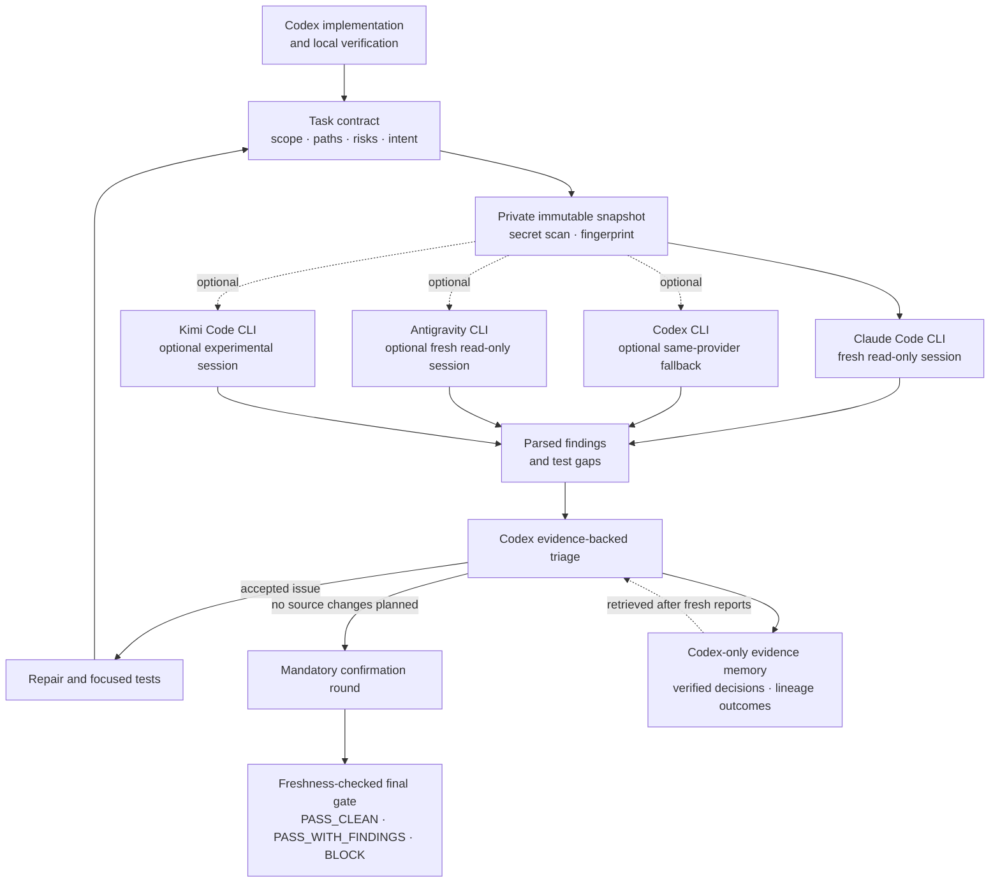

# Codex Multi-Model Review

[](https://github.com/shoti/codex-multi-model-review/actions/workflows/ci.yml)
[](https://www.python.org/)
[](LICENSE)

Auditable, bounded multi-model code reviews for Codex.

Codex remains the implementer and final verifier. Reviewer CLIs inspect an
immutable repository snapshot in fresh, read-only sessions. Their findings
become evidence-backed decisions, not automatic edits, and the final gate
becomes invalid when the reviewed source changes. A fresh Codex subprocess can
replace Claude when its allowance is unavailable; that review is isolated but
is explicitly reported as same-provider-family evidence. Its process receives
only a minimal non-secret environment, shell and exec tools are disabled, and
API-key authentication is rejected; use ChatGPT login.

Claude Code is enabled by default. Codex review fallback, Antigravity, and Kimi
Code are optional and disabled until explicitly enabled.

> This is an independent community project. It is not affiliated with or
> endorsed by OpenAI, Anthropic, Google, Moonshot AI, or their affiliates.

## Why

Asking several models to “review this diff” does not create a reliable gate by
itself. Reports can inspect moving code, repeat already-rejected findings,
silently miss part of the task, consume unbounded credits, or become stale
after the next edit.

Codex Multi-Model Review turns that conversation into a durable workflow:

- each reviewer starts fresh and does not see another reviewer's findings;
- reviewers inspect the same private, immutable repository snapshot;
- Codex verifies every finding against repository evidence;
- repair rounds are bounded and followed by mandatory confirmation;
- scope, paths, risks, profile, and task intent stay pinned across rounds;
- provider failures, usage, decisions, test gaps, and acknowledged structured
  observations are persisted;
- reviewers disclose incomplete coverage and unreviewed changed paths in a
  structured contract that cannot disappear into free-form notes;
- Claude and Codex output is schema-constrained and partial provider failures
  are resumable;
- provider attempts, quota cooldowns, authentication mode, and token telemetry
  are tracked across the whole successor lineage;
- a private rebuildable evidence index helps Codex compare prior verified outcomes
  after fresh reviewers finish, without biasing reviewer prompts;
- a final PASS is valid only while its source fingerprint remains fresh.



## Requirements

- macOS or Linux. Native Windows is not currently supported.
- Python 3.12 or newer.
- Git.
- A current Codex CLI with `codex plugin` support. The optional Codex reviewer
  requires Codex CLI 0.138.0 or newer for workspace-only permission profiles.
- At least one installed and authenticated reviewer CLI.
- The optional Codex reviewer currently requires file-backed ChatGPT CLI
  credentials (`cli_auth_credentials_store = "file"`). It rejects API-key and
  keyring-backed auth because those paths cannot provide the same verified
  process isolation.
- GitHub CLI (`gh`), authenticated, only when Codex should create or update a
  pull request.

The runner has no third-party Python dependencies.
It fails immediately with an actionable version error before creating a
workflow or invoking a provider when the interpreter is older than Python 3.12.

| Reviewer | Default | Executable | Notes |
|---|---:|---|---|
| Claude Code | Enabled | `claude` | `sonnet`, medium effort, and a $1.25 maximum per review by default |
| Codex | Disabled | `codex` | Ephemeral, schema-constrained, workspace-only fallback; same provider family as the controller |
| Antigravity | Disabled | `agy` | Requires authenticated model access and the bundled hard read-only agent |
| Kimi Code | Disabled | `kimi` | Experimental adapter; validates that the configured model alias is available |

Provider CLIs are separate products with their own installation,
authentication, terms, data handling, quotas, and billing.

## Using GPT-6 Astra

The controller skill works with GPT-6 Astra without an API port: this plugin
invokes reviewer CLIs and does not build OpenAI API requests. The controller's
model and the optional Codex reviewer's model are separate choices. The
reviewer's private `CODEX_HOME` deliberately excludes your personal model and
reasoning configuration; `default` uses the installed CLI's default, which
does not promise the same model as the current conversation.

To pin the optional reviewer explicitly:

```bash
python3 <plugin-root>/skills/multi-model-review/scripts/mm_review.py set-model codex gpt-6-astra
```

This does not enable it. Use `--with-codex --codex-model gpt-6-astra` on a
`run` for a temporary selection, and repeat it on confirmation. Existing
model pins remain valid until you deliberately change them. `set-effort`
controls Claude only.

The [official GPT-6 migration guidance](https://developers.openai.com/api/docs/guides/latest-model)
recommends auditing skill instructions for conflicting approval and completion
rules. Reviewer prompts therefore explicitly require headless completion,
record blocked inspection under Coverage, and prevent repository instructions
from overriding the review contract. Model upgrades never relax tool isolation,
secret screening, mandatory confirmation, or source freshness checks.

Use an authenticated live review to establish account/model access. The
offline fixture suite verifies orchestration and rejection of malformed or
unfinished reports; it cannot establish real model quality or availability.

## Installation

Add this GitHub repository as a Codex marketplace, then install the plugin:

```bash
codex plugin marketplace add shoti/codex-multi-model-review --ref main
codex plugin add multi-model-review@codex-multi-model-review
```

Start a new Codex thread after installation so its skill and slash command are
loaded.

To update later:

```bash
codex plugin marketplace upgrade codex-multi-model-review
codex plugin add multi-model-review@codex-multi-model-review
```

For local development:

```bash
git clone git@github.com:shoti/codex-multi-model-review.git
cd codex-multi-model-review
codex plugin marketplace add "$PWD"
codex plugin add multi-model-review@codex-multi-model-review
```

The repository-root marketplace layout is exercised locally before release.
See the official [Codex plugin packaging
guide](https://developers.openai.com/plugins/build/plugins) for marketplace
concepts and alternative layouts.

## Quick start

In a new Codex thread:

> Use $multi-model-review to review my uncommitted changes. Limit the task to
> `src/feature` and `tests/feature`, use the security profile, and keep optional
> reviewers disabled.

Or invoke the bundled command:

```text
/multi-model-review:multi-review uncommitted without-antigravity without-kimi
```

Codex will create the workflow, run the repair and triage loop, perform the
mandatory confirmation, and return a freshness-checked final gate.

Run static diagnostics before the first provider review:

```bash
python3 <plugin-root>/skills/multi-model-review/scripts/mm_review.py doctor
```

`mm-review` is an optional local PATH shortcut. The bundled Python command
always works. `doctor` reports the exact plugin version, plugin root, runner
path, and runner SHA-256; review artifacts persist the same identity. When
developing the plugin, invoke the intended source runner directly—a cached
runner can establish parity only with its own installed bundle.

## Workflow

The normal Codex-driven flow is:

1. Finish the implementation and focused local checks.
2. Start one workflow for the user task with a deliberate review mode and a
   per-provider attempt ceiling.
3. Run a repair review against explicit scope, paths, risks, intent, and any
   stable acceptance criteria or critical invariants.
4. Verify and disposition every finding and test gap.
5. Fix accepted items. A `fixed` or `covered` decision requires verification
   and task-scoped bytes that differ from the reviewed snapshot. Then run
   formatter, lint/static checks, and the complete relevant suite before another
   provider call; record the results with `--local-verification`.
6. Repeat only when necessary, within the selected repair-round limit.
7. Run one mandatory confirmation with no further source changes planned,
   reusing the pinned repair contract.
8. Attach concrete Codex-owned evidence to every pinned claim. Critical
   invariants must be verified; a deliberately deferred non-critical criterion
   remains visible and limits the result to `PASS_WITH_FINDINGS`.
9. Finalize and verify the freshness-checked repository gate, then finalize the
   workflow so its state becomes explicitly `completed`.
10. If authorized later, attest the unchanged reviewed snapshot to its commit.
   A local source gate and a deployment-bound gate are reported separately.
11. When the user authorizes commit and push, generate concise PR copy focused
    on the problem, evidence or root cause, and resulting behavior, then create
    the branch's PR with that description or update its open PR. Verify the
    account, repository, branches, existing body, and post-write result with
    GitHub CLI; no other PR mutations are implied.

If the confirmation reviewer reports incomplete coverage, finalization stops.
Run another independent review or inspect every disclosed path and limitation,
then pass concrete `--coverage-verification` evidence. The final artifact keeps
both the provider's limitation and Codex's compensation visible.

Review mode is pinned with the workflow:

| Mode | Use for | Repair policy |
|---|---|---|
| `fast` | Small, localized, low-risk changes | One low-effort repair, then medium-effort confirmation |
| `balanced` | Ordinary features and bug fixes; the default | Up to two medium-effort repairs, then confirmation |
| `deep` | Auth, money, trading, data writes, migrations, email, security, or broad cross-component changes | Up to three medium-effort repairs, then confirmation |

Every mode retains the immutable snapshot, full triage, mandatory fresh
confirmation, freshness verification, and commit attestation controls. Use
`deep` whenever a risk label applies; speed should come from avoiding redundant
rounds, not weakening a high-impact review.

If one provider fails after another provider has produced a valid report, the
run is preserved as `partial`. Resume that exact immutable snapshot instead of
consuming the successful provider's allowance again. If the task contract must change after a
confirmation, explicitly supersede the closed workflow so the lineage remains
auditable. All prior successful and failed attempts follow that lineage; a
successor is not a fresh allowance. Post-fix local-verification requirements
also follow the lineage. A successor may use `--reuse-contract` to keep the
original pinned contract, or specify a new contract intentionally. Recorded
evidence satisfies the requirement for that exact fingerprint; later source
changes require fresh local evidence. A successor also inherits the complete
set of repositories reviewed by its ancestors. Every inherited repository must
produce a fresh successor final before the workflow can close; omitting one is
reported as `not-reviewed`, not silently treated as reduced scope.

Secret and symlink checks that stop before any provider invocation are reported
as `preflight_blocked`, separately from failed reviews and provider failures.
Exact initial secret approvals remain one-shot and fingerprint-bound. A later
round may explicitly reuse an approval only within the same lineage and only
when its path, line, rule, key, and line-content hash are identical.
An unchanged tracked recognized sensitive file may instead be omitted from the
private provider snapshot with `--exclude-snapshot-path`; the runner records
Git/SHA-256 provenance, pins the exclusion, and requires explicit Codex coverage
verification. Changed, task-scoped, untracked, directory, symlink, or ordinary
code paths cannot be excluded.
When attaching an existing successor with `workflow supersede --by`, its
provider-usage policy must exactly match the current lineage policy.

Before starting, `mm-review recommend` can conservatively suggest `fast`,
`balanced`, or `deep` from the actual changed paths and explicit risks. The
recommendation is advisory and any selected risk keeps the result at `deep`.
`mm-review budget-estimate` remains a compatibility diagnostic for Claude's
native USD-denominated print-mode stop. Its output is an API-price equivalent,
not proof of subscription billing. Lifecycle decisions use provider readiness,
known quota cooldowns, attempts, and reported tokens instead.
Disabled and unprobed providers are never labeled ready, and coverage summaries
name only providers that actually returned successful evidence.

Resume history is append-only: earlier attempt metadata and provider artifacts
remain available, and every attempt counts toward the workflow's per-provider
ceiling. Claude native-stop exhaustion requires an explicit one-resume effort
or stop override instead of silently repeating the same capped attempt.
For a typed Claude quota, authentication, or budget-stop failure, the operator
may explicitly use `resume --replace-failed-claude-with-codex`. The runner
preserves the Claude failure, recreates and verifies the same immutable
snapshot, and records the substitution before accepting a schema-constrained
Codex report. Codex receives a temporary private `CODEX_HOME`; its ChatGPT
credential is available to the CLI process while the reviewer cannot use a
shell, exec, command network, browser, connector, or delegation surface. The
only inspection interface is an embedded read-only MCP server
whose `read_file`, `list_directory`, and literal `search` tools resolve and
validate every path against the immutable snapshot and staged-input roots.
Host files and credential-manager processes are therefore unreachable rather
than merely hidden from `PATH`. A temporary `CODEX_HOME` makes global user
config unavailable while loading only the generated review profile, and the
temporary home is removed after the attempt. Coverage remains clearly labeled as
same-provider-family.
Before confirmation, `continue` warns when fewer than three attempts remain for
an enabled provider. Use `workflow raise-provider-attempt-limit --to <count>
--reason <reason>` for an explicit increase; the audit record is append-only and
the command cannot lower the ceiling. A repair is blocked before provider
invocation if too few attempts remain to reach mandatory confirmation. When
repair plus confirmation consume all remaining headroom, Claude is also blocked
if its configured stop is below a medium/high-confidence historical
recommendation. The same underfunded last-chance guard applies when confirmation
has only its final allowed attempt. The preflight artifact records the evidence
and none of these blocks consumes a provider attempt.

Resume holds a run-specific lock for the complete transaction. Overlapping
attempts against one artifact serialize; after the first succeeds, the next
observes that the run is already complete instead of sharing its snapshot or
overwriting its evidence.

For the complete operational contract, see
[SKILL.md](skills/multi-model-review/SKILL.md).

### Scopes

| Scope | Meaning |
|---|---|
| `--uncommitted` | Staged, unstaged, and untracked changes |
| `--base <branch>` | Feature branch relative to a base, plus working-tree changes |
| `--commit <sha>` | One checked-out commit |

`--path` limits the changed paths, patch, fingerprint, and task contract. For
review context, the immutable snapshot still contains the entire tracked Git
tree at the selected revision. Read [Privacy and data handling](#privacy-and-data-handling)
before reviewing a sensitive repository.

The runner prints and records changed paths excluded by `--path`. Inspect that
local notice: keep unrelated dirty files excluded, but include every changed
dependency required by the reviewed behavior.

For a path-filtered `--commit` review, working-tree changes outside those paths
do not block the immutable commit snapshot. Changes inside the reviewed paths
still fail closed so task-scoped work cannot be omitted accidentally.

### Risk labels and profiles

Risk labels are repeatable:

`auth`, `backfill`, `db-write`, `email-send`, `email-deliverability`,
`external-api`, `migration`, `security`, and `trading`.

Profiles are:

`normal`, `security`, `data-change`, `external-api`, `trading`, and
`email-deliverability`.

These are generic review presets. They do not indicate that this repository
contains applications or data in those domains.

## Advanced manual example

Codex normally operates these commands through the skill. For debugging or
automation, the runner can be driven directly:

```bash
RUNNER="<plugin-root>/skills/multi-model-review/scripts/mm_review.py"

python3 "$RUNNER" doctor
python3 "$RUNNER" workflow start \
  --name "harden session validation" \
  --max-provider-attempts 6

python3 "$RUNNER" run \
  --repo /path/to/repository \
  --uncommitted \
  --workflow-id <workflow-id> \
  --phase repair \
  --path src/session \
  --path tests/session \
  --risk auth \
  --risk security \
  --review-profile security \
  --criterion 'SESSION-1=Expired sessions are rejected' \
  --critical-invariant 'SESSION-2=Valid sessions remain authorized' \
  --task "Reject expired sessions without changing valid-session behavior"
```

The run output identifies its artifact directory. Record each disposition:

```bash
python3 "$RUNNER" decide \
  --run <run-directory> \
  --finding claude-001 \
  --decision rejected \
  --evidence "The reported path is unreachable after validation." \
  --verification "Focused session test passes."
```

Reviewer criterion declarations are advisory coverage, not proof. After Codex
independently inspects repository, test, artifact, or safe runtime evidence,
attach it to each pinned claim:

```bash
python3 "$RUNNER" assure \
  --run <run-directory> \
  --claim SESSION-1 \
  --status verified \
  --evidence-kind test \
    --evidence "tests/session/test_expiry.py::test_expired_session passes"
```

When several claim decisions are already known, record them as one atomic
batch so a validation failure cannot leave a partially completed assurance
set:

```bash
python3 "$RUNNER" assure-batch \
  --run <run-directory> \
  --item '{"claim":"SESSION-1","status":"verified","evidence_kind":"test","evidence":"tests/session/test_expiry.py::test_expired_session passes"}' \
  --item '{"claim":"SESSION-2","status":"verified","evidence_kind":"repository","evidence":"src/session/guard.py retains valid-session authorization"}'
```

Each `--item` uses the same `claim`, `status`, `evidence_kind`, `evidence`, and
optional `rationale` fields as `assure`. Duplicate claim IDs are rejected. The
runner acquires the assurance lock once, validates the complete batch, and
writes `assurance.json` and `assurance.md` only after every item succeeds.

Claims use stable `ID=TEXT` values and are part of the pinned review contract.
Adding, changing, or dropping one after a completed review requires an explicit
successor. `--reuse-contract` preserves the exact claim set across repair,
confirmation, and successor lineage. `assurance.json` and `assurance.md` record
the source-bound machine and human views; later source changes invalidate the
evidence. Existing workflows without a claim contract remain readable and are
labeled `legacy_unassured` rather than receiving fabricated coverage.

If the run is partial, retry only its failed reviewers without changing the
source:

```bash
python3 "$RUNNER" resume --run <partial-run-directory>
```

If Claude reached its per-review cap, choose an explicit retry policy while
keeping the source unchanged:

```bash
python3 "$RUNNER" resume --run <partial-run-directory> \
  --claude-max-budget-usd 2 --claude-effort medium
```

Or explicitly substitute Codex after a typed Claude availability failure:

```bash
python3 "$RUNNER" resume --run <partial-run-directory> \
  --replace-failed-claude-with-codex
```

For a new round where Claude is already known to be unavailable, use
`--without-claude --with-codex`.

Ask the runner for the next lifecycle action without invoking a provider:

```bash
python3 "$RUNNER" continue <workflow-id>
```

Authorize exactly one available provider-review step with
`continue <workflow-id> --execute-review`. After confirmation triage and Codex's
final diff review, consolidate the final gate:

```bash
python3 "$RUNNER" gate <workflow-id> \
  --codex-verdict PASS_CLEAN \
  --check-result '{"name":"required tests","status":"passed","exit_code":0,"evidence":"Full required suite passed on the reviewed source."}' \
  --codex-review "Final diff review found no remaining defect." \
  --verification "Focused tests: passed" \
  --attest-commit
```

When repair triage is complete, load the pinned contract for confirmation, then:

```bash
python3 "$RUNNER" run --repo /path/to/repository \
  --workflow-id <workflow-id> --phase confirmation --reuse-contract

python3 "$RUNNER" finalize \
  --run <confirmation-run-directory> \
  --codex-verdict PASS_CLEAN \
  --check-result '{"name":"required tests","status":"passed","exit_code":0,"evidence":"Full required suite passed on the reviewed source."}' \
  --codex-review "Final diff review found no remaining defect." \
  --verification "Focused tests: passed"

python3 "$RUNNER" verify --run <confirmation-run-directory>
python3 "$RUNNER" workflow finalize <workflow-id>
```

Required checks now have structured results. Pass one `--check-result` JSON
object per required check, with `name`, `status` (`passed`, `failed`, `not_run`),
`exit_code` (zero for passed, nonzero for failed, null for not_run), and `evidence`.
Missing results or any failed/unrun check force `BLOCK`; prose `--verification`
and `PASS_WITH_FINDINGS` cannot override that. Existing failures count, including
failures outside the review path filter. Report all required local/CI checks;
the runner validates reports but does not execute commands or discover omitted
checks. A local passing gate is not proof of successful remote CI.

Historical finals without structured validation remain inspectable but are no
longer readiness evidence. Refinalize unchanged confirmed source with current
check results; do not manufacture results for old runs.

`workflow status` reports both `ready` and `deployment_ready`. A clean working
tree review proves the local source gate only. After committing the exact bytes,
run the `attest-commit` command printed by `workflow finalize` or `continue`,
then verify again. A commit-bound review still does not prove a deployed runtime,
live data, broker submission, email delivery, or external side effect; collect
that application-specific evidence separately when required.

The explicit scope selector may be omitted. When present, it must resolve to
the pinned scope; paths, risks, profile, and task cannot be re-specified.
`--codex-verdict` is required and accepts `PASS_CLEAN`, `PASS_WITH_FINDINGS`,
or `BLOCK`. The machine gate uses the more conservative result of Codex's
verdict and the complete triage history for that repository's workflow.
Deferred items from earlier rounds and superseded task-lineage ancestors remain
in the final artifact under run-qualified IDs until a later matching decision
resolves them. Verification also hashes that complete triage set, so a later
decision change makes the final gate stale instead of silently changing its
meaning.

Reviewer Notes are neutral context only. Demonstrably non-actionable facts use
the structured Observations section and require an evidence-backed
`acknowledged` decision. Any plausible risk or recommended code/test change
must remain a finding or test gap.

### Supplemental rechecks

When a finalized snapshot is still fresh and the user asks one additional
question, avoid consuming allowance for another repair-plus-confirmation pair:

```bash
python3 "$RUNNER" run \
  --supplemental-of <finalized-run-directory> \
  --task "Check this unchanged snapshot for the focused concern"
python3 "$RUNNER" finalize \
  --run <supplemental-run-directory> \
  --codex-verdict PASS_CLEAN \
  --check-result '{"name":"required tests","status":"passed","exit_code":0,"evidence":"Full required suite passed on the reviewed source."}' \
  --codex-review "Focused recheck result"
python3 "$RUNNER" verify --run <supplemental-run-directory>
```

This performs exactly one fresh review and writes `supplemental.json` with an
explicitly non-authoritative status. It never replaces the parent `final.json`.
Every supplemental sibling shares the parent's provider-attempt lineage and
active reservations, so repeated rechecks cannot create new allowances.
If it identifies a real issue requiring source changes, create a normal linked
successor and run the full repair/confirmation workflow.

### Token-efficient inspection

Provider-reported token counters are aggregated by provider, model, review
mode, and phase; local artifact sizes are aggregated by mode and phase. The
runner does not estimate missing provider usage or confuse bytes with tokens:

```bash
python3 "$RUNNER" analytics --since-days 30 --format compact
python3 "$RUNNER" workflow status <workflow-id> --format compact
python3 "$RUNNER" workflow audit --stale-days 7 --format compact
python3 "$RUNNER" budget-estimate --uncommitted --review-mode balanced
```

Complete JSON remains the default for scripts and auditing. Compact output is
opt-in, points back to full artifacts/evidence, and automatically falls back to
JSON if it would emit more UTF-8 bytes.
Analytics keeps explicit adaptive-mode lineages separate from modes inferred
for legacy workflows, reports unclassified legacy run records, and exposes
API-equivalent/duration/patch distributions. `workflow audit` is read-only: it
recomputes modern workflow freshness and identifies pending triage, unclosed run
finals, blocked gates, `ready_to_finalize`, `completed_stale`, failures, and stale
incomplete work without rewriting or deleting evidence.

### Evidence memory

The authoritative record remains the private JSON artifacts. A derived local
SQLite index makes their triaged evidence searchable by repository, finding
kind, title, path, evidence, action, verification, lineage, and decision:

```bash
python3 "$RUNNER" memory rebuild
python3 "$RUNNER" memory status
python3 "$RUNNER" memory search "duration threshold alert" --format compact
python3 "$RUNNER" memory compact
```

Memory retrieval happens only after independent reports return and is never
included in external reviewer prompts. The index is rebuildable and introduces
no third-party dependency or network call. `compact` affects only the derived
index; authoritative artifacts remain append-only and are never deleted
automatically.
When a triage item has `memory_matches`, Codex may add
`--memory-assessment useful|irrelevant|mixed` to `decide`, or the equivalent
`memory_assessment` field to `decide-batch`. Analytics reports candidate and
assessment counts separately from exact repeated-title matches, providing
evidence for future retrieval tuning without influencing reviewers.

## Command reference

| Command | Purpose |
|---|---|
| `status` | Show reviewer configuration and readiness |
| `doctor [--live]` | Check packaging, permissions, CLI contracts, and optional live access |
| `enable` / `disable [--lock]` | Persist reviewer availability; a lock also rejects one-run overrides |
| `set-model` | Set a reviewer model |
| `set-effort` | Set Claude reasoning effort |
| `set-claude-usage-limit` | Set Claude's USD-denominated API-equivalent emergency stop; this is not subscription billing |
| `set-provider-attempt-limit` | Set the default per-provider attempt ceiling for new workflows |
| `set-provider-use-policy` | Require explicit provider execution or permit one-step automatic continuation |
| `set-budget` / `set-workflow-budget` | Compatibility commands for Claude's native stop and legacy workflows |
| `continue` | Report the next lifecycle action and optionally execute one available provider-review step |
| `gate` | Finalize, verify, optionally attest, and close a ready workflow |
| `workflow start/status/audit/supersede/finalize` | Manage adaptive review mode and task lineage; audit is read-only and status/audit support compact output |
| `scan` | Issue a one-shot fingerprint-bound approval after inspecting secret findings |
| `run` | Execute a repair, confirmation, or exact-content supplemental round |
| `resume` | Retry only failed reviewers from an unchanged partial run |
| `decide` / `decide-batch` | Persist evidence-backed triage and optional memory-candidate assessments |
| `assure` / `assure-batch` | Attach fingerprint-bound Codex evidence to one pinned claim or atomically to several claims |
| `finalize` | Produce a final gate, requiring Codex evidence for incomplete confirmation coverage |
| `verify` | Confirm that the gate still matches current source |
| `attest-commit` | Bind unchanged reviewed content or a clean reviewed `--base` branch to the checked-out commit |
| `recover` | Mark an orphaned run failed after its process exits |
| `analytics` | Summarize explicit versus inferred mode cohorts, workflow outcomes, tokens, API-price equivalents, artifact bytes, memory telemetry, failures, and closure |
| `recommend` | Suggest a conservative review mode from current paths and explicit risks |
| `budget-estimate` | Report an advisory historical Claude API-equivalent estimate without changing policy |
| `memory status/rebuild/search/compact` | Maintain and query ranked Codex-only verified evidence; search supports opt-in compact output |

Use `python3 .../mm_review.py <command> --help` for all flags.

## Trust model

| Control | What it provides | Boundary |
|---|---|---|
| Immutable snapshot | Reviewers do not inspect a changing checkout | The tracked repository tree is passed to every enabled provider CLI |
| Read-only sessions | Reviewers receive read/search-only tool policies; Codex additionally uses a root-denying permission profile, approvals disabled, an isolated temporary config home, direct-only review MCP tools, and ephemeral persistence | Provider and CLI implementations remain dependencies |
| Independent prompts | Provider-specific input directories expose only the snapshot, patch, manifest, and prompt—not peer reports, metadata, or Codex triage | All reviewers receive the same task contract and source |
| Secret screening | Blocks likely credentials, sensitive paths, external symlinks, and common secret patterns across the complete outgoing snapshot | It remains heuristic and is not a substitute for a dedicated repository scanner |
| Evidence-backed triage | Codex records why every item was accepted, fixed, rejected, deferred, or uncertain | Model agreement is not evidence |
| Claim-to-evidence assurance | Stable criteria and critical invariants map to concrete Codex-owned evidence and freshness | Reviewer `verified` declarations remain advisory coverage, and no numeric confidence is produced |
| Evidence memory | Codex can retrieve similar prior decisions after fresh reports finish | Historical evidence is never passed to reviewers and the JSON artifacts remain authoritative |
| Freshness checks | Scoped source changes invalidate the final gate | A finalized confirmation is intentionally closed |
| Approval boundary | Review results never authorize external actions | The user retains authority over commits, merges, deployments, migrations, and production changes |

Sensitive paths and external symlinks always fail closed and cannot be waived.
Direct reusable finding IDs and broad sensitive-path overrides are rejected.

When a changed line matches a secret rule but is intentionally safe test data,
run `scan --approve-findings` against the exact scope and paths first. The
resulting token is one-shot and bound to the repository, task paths, findings,
task source fingerprint, and content fingerprint of every file sent externally.
It cannot approve later edits, a broader review, a sensitive path, or an
external symlink.

## Privacy and data handling

The runner does not add a separate telemetry service, but enabled provider CLIs
may transmit reviewed source to their providers under those providers' terms
and account settings. Review only code you are authorized to share with every
enabled provider.

The snapshot contains the entire tracked Git tree at the reviewed revision,
plus the task-scoped working-tree overlay. Path filters do not make unchanged
tracked files private. Secret screening now checks every file in that complete
outgoing snapshot plus deleted patch material, including unchanged tracked
files. Inspect sensitive repositories before starting an external review.

Each provider receives a separate staged input directory outside the durable
artifact root. Resumed reviewers cannot read successful peer reports,
`review-summary.json`, `triage.json`, or `metadata.json`; those remain private
to Codex and the runner.

Persistent local state is stored under:

- `~/.codex/review-runs/`;
- `~/.codex/review-runs/sensitive-scans/` for one-shot scan approvals;
- `~/.codex/review-runs/evidence-memory.sqlite3` for rebuildable Codex-only
  evidence search;
- `~/.config/multi-model-review/config.json`;
- `~/.config/multi-model-review/provider-health.json`.

When a host Codex sandbox cannot write the default artifact store, set
`MM_REVIEW_RUNS_DIR` to one absolute private writable directory for the entire
workflow. `MM_REVIEW_CONFIG_DIR` similarly relocates persistent configuration.
Do not alternate stores within one lineage. Permission failures are reported as
actionable errors instead of raw Python tracebacks.

Artifacts can contain patches, repository paths and origin, task prompts,
reviewer responses, raw provider output, usage metadata, triage evidence, and
claim-to-evidence assurance records. Assurance records reject credential-like
evidence and retain only necessary reviewer coverage references, not raw
provider prose.
They are created with private permissions on supported systems, but must not be
committed, uploaded, or attached to public issues.

Provider executables are resolved from `PATH`. Install trusted CLIs from their
official distribution channels and verify which executable your shell selects.

The built-in secret scan is defense in depth. It scans complete non-binary
tracked files and deleted patch lines for its configured patterns, but pattern
coverage is necessarily heuristic and binary content is not interpreted. It is
not a substitute for a repository secret scanner or deliberate source review.

## Provider usage controls

New workflows are controlled by provider allowance rather than a fictional
cross-provider dollar budget. The runner records, per provider:

- subscription, API-billed, or unknown authentication mode when observable;
- successful and failed attempts across the complete successor lineage;
- an atomic per-provider attempt reservation for concurrent repositories;
- provider-reported token telemetry and turns;
- quota cooldowns and reset evidence returned by the CLI;
- `unknown` when remaining plan allowance is not exposed.

The default ceiling is six attempts per provider per lineage. Exhausting one
provider does not manufacture more quota or convert another provider's usage
into dollars: a ready enabled reviewer may continue independently, while a
workflow with no available reviewer reports `WAIT_FOR_PROVIDER`.

Codex review uses the authenticated Codex CLI allowance and records observable
authentication mode and provider-reported token usage. It does not claim
cross-provider independence: the subprocess is fresh and artifact-isolated,
but it belongs to the same provider family as the controlling Codex session.

Claude's non-interactive CLI still requires a USD-denominated `--max-budget-usd`
stop. The plugin retains it as a per-call emergency brake and stores
`total_cost_usd` as an API-price equivalent. For subscription authentication,
that figure is not treated as a bill. If an `ANTHROPIC_API_KEY` overrides the
subscription, status reports API-billed mode and the same figure may represent
real token billing. Independently of Claude's own enforcement, the runner fails
the review closed if the reported API-price equivalent exceeds that per-call
stop plus the existing 10% provider-overrun safety reserve. This check is a
per-call safety invariant, not workflow dollar accounting.

Legacy workflows keep their original cumulative-dollar behavior so historical
artifacts and gates remain verifiable. New workflows set
`enforce_lineage_api_equivalent_cap=false`; their authoritative lifecycle guard
is provider attempts plus observed quota/readiness state.

`continue` is read-only under the default `explicit` policy. Use
`--execute-review` to consume one available review step, or deliberately set
`provider_use_policy=auto`. Neither mode invents an unavailable remaining-quota
percentage, triage decision, or Codex verdict.

`doctor --live` performs provider calls and gives its Claude probe a small
native emergency stop. Plain status and doctor calls do not probe disabled
providers.

## Troubleshooting

- **Cache/source mismatch:** update the marketplace, reinstall the plugin, and
  start a new thread.
- **Provider CLI missing:** install the provider's official CLI and authenticate
  it, then rerun `doctor`.
- **Codex permission-profile contract missing:** upgrade Codex CLI to 0.138.0 or
  newer; the fallback refuses older clients instead of using broad host reads.
- **Antigravity agent missing or changed:** run
  `mm-review install-antigravity-agent`.
- **Quota cooldown:** wait for the reported reset or disable that provider.
- **Interrupted run:** after confirming its process exited, use
  `mm-review recover --run <run-directory>`.
- **Partial run:** keep the source unchanged and use
  `mm-review resume --run <run-directory>`; only failed reviewers run again.
- **Claude native stop exhausted:** resume only with an explicit
  `--claude-max-budget-usd` and/or lower `--claude-effort`; the provider-attempt
  ceiling still applies. For a typed quota, authentication, or budget-stop
  failure, explicitly use `--replace-failed-claude-with-codex` when same-provider-
  family coverage is acceptable.
- **Artifact-store permission denied:** set `MM_REVIEW_RUNS_DIR` to an absolute
  private writable directory for the complete workflow, or approve access to
  the configured store.
- **Provider attempt allowance exhausted:** wait for quota reset, enable another
  provider, or intentionally supersede with a matching revised usage policy.
- **Stale final gate:** `mm-review continue <workflow-id>` reports
  `NEEDS_SUCCESSOR` with the exact non-automatic `workflow supersede` command;
  run it intentionally, then review under the reported successor workflow.
- **Changed confirmation contract:** invoke `mm-review workflow supersede
  <workflow-id> --reason "<why>"` directly, then review under the reported
  successor workflow.
- **Review contract drift:** use `--reuse-contract` for confirmation. Explicitly
  supersede only when scope, paths, risks, profile, or task truly changed.
- **Sensitive material blocked:** remove it from scope, or run
  `mm-review scan ... --approve-findings` and pass the returned token to the
  exact review after inspecting every redacted finding. External symlinks and
  sensitive paths cannot be approved this way.
- **Kimi model unavailable:** choose an alias reported by
  `kimi provider list --json`, or leave Kimi disabled.
- **Malformed provider output:** inspect the redacted error artifact, update the
  provider CLI if needed, and rerun a fresh review.
- **`mm-review` is not on PATH:** invoke the bundled Python script directly.
- **Updated plugin is not visible:** start a new Codex thread after reinstall.

## Limitations

- External reviewers can miss defects or report false positives.
- This workflow is not a formal proof or a replacement for tests, security
  assessment, or human approval.
- Provider CLI flags and output formats can change; `doctor` fails closed when
  required contracts are unavailable.
- Windows is not supported natively because the runner uses POSIX file locks,
  permissions, signals, and process groups.
- Source is sent to every enabled reviewer provider.
- Codex fallback is a fresh second review, not independent external-model
  diversity.
- Kimi support relies on an experimental CLI and may change.
- A later scoped edit requires a new workflow after confirmation.
- Commits, pushes, merges, deployments, migrations, backfills, messages, and
  live transactions remain outside the plugin's authority.
- An explicit commit-and-push request produces a concise GitHub PR description
  and authorizes creating the branch's PR or updating its open PR. Evidence-based
  fixes use `Production evidence` and `Fix`; ordinary fixes use `Summary` and
  `Fix`; new features use `Summary` and `What changed`. Routine test and file
  inventories are intentionally omitted unless they materially affect the merge
  decision.
- The workflow verifies account/repository/branch targeting, protects material
  existing descriptions from silent overwrite, uses a private body file, reads
  the result back, and never treats commit-and-push authority as permission for
  reviewers, labels, comments, merges, or other GitHub changes.

## Contributing and security

See [CONTRIBUTING.md](CONTRIBUTING.md) for the dependency-free development
workflow and [SECURITY.md](SECURITY.md) for private vulnerability reporting.

## License

Released under the [MIT License](LICENSE).
